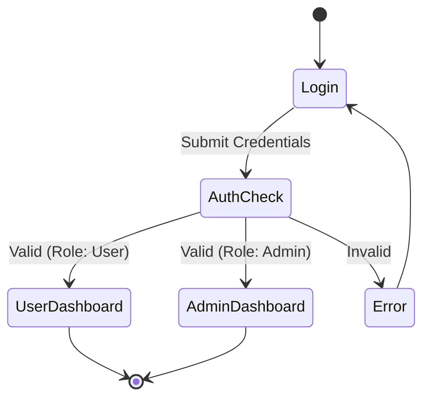

# Smart Task Hub: Project Documentation

## 1. Title Page
**Project Name:** Smart Task Hub
**Project Type:** Premium Full-Stack Task Management System
**Tech Stack:** MERN (MongoDB, Express.js, React.js, Node.js)
**Version:** 2.0 (Production Ready)
**Author:** [USER]
**Date:** May 14, 2026

---

## 2. Acknowledgement
I would like to express my gratitude to the developers and tools that facilitated the creation of the **Smart Task Hub**. Special thanks to the MERN stack community and open-source contributors for providing robust frameworks that made this complex system possible. This project represents a culmination of full-stack development best practices and modern UI/UX design principles.

---

## 3. Index
1. Abstract
2. Problem Statement
3. Objectives
4. Scope
5. System Architecture
6. Database Design
7. Frontend Development
8. Backend Development
9. Integration
10. Testing (Test Cases & Defect Reports)
11. Results & Conclusion
12. Diagrams (Use Case, ER, Class, Activity, Sequence, DFD)
13. Future Enhancements
14. References & Appendices

---

## 4. Abstract
**Smart Task Hub** is a premium, full-stack task management application designed to bridge the gap between simple to-do lists and complex enterprise project management tools. It provides a highly visual, role-based environment where standard users can manage personal productivity via tasks, calendars, and statistics, while administrators can moderate users, control system-wide categories, and monitor global activity through a secure console.

---

## 5. Problem Statement
Traditional task management applications often suffer from:
- **Lack of Role Separation**: Minimal distinction between regular users and system administrators.
- **Poor Visual Feedback**: Text-heavy interfaces with little data visualization.
- **Rigid Categorization**: Inability to define and color-code custom categories system-wide.
- **Insecure Recovery**: Non-functional or poorly designed password recovery flows.

---

## 6. Objectives
- **Role-Based Access Control (RBAC)**: Distinct interfaces for Users and Admins.
- **Real-Time Notifications**: System-level alerts for user actions.
- **Data Visualization**: Graphs and charts for productivity tracking.
- **Responsive Premium Design**: A state-of-the-art UI with glassmorphism and smooth animations.
- **Security**: Robust JWT authentication and secure password reset mechanisms.

---

## 7. Scope
- **User Module**: Task CRUD, Profile management, Statistics, Calendar view.
- **Admin Module**: User moderation, System-wide Task monitoring, Global Category management, System Insights.
- **Auth Module**: Secure Login/Register, Admin Secure Portal, Forgot Password (SMTP Integration).
- **Database**: MongoDB for persistent storage of users, tasks, categories, and notifications.

---

## 8. System Architecture

```mermaid
graph TD
    subgraph \"Frontend (React.js)\"
        UI[User Interface]
        RC[React Components]
        RS[State Management/Services]
    end

    subgraph \"Backend (Node.js & Express)\"
        API[RESTful API Endpoints]
        MW[Auth Middleware]
        CTRL[Business Logic Controllers]
    end

    subgraph \"Database (MongoDB)\"
        DB[(MongoDB Atlas)]
    end

    UI --> RC
    RC --> RS
    RS -- \"Axios Requests\" --> API
    API --> MW
    MW --> CTRL
    CTRL --> DB
```

---

## 9. Database Design (ER Diagram)

```mermaid
erDiagram
    USER ||--o{ TASK : creates
    USER ||--o{ NOTIFICATION : receives
    CATEGORY ||--o{ TASK : classifies

    USER {
        string _id PK
        string name
        string email
        string password
        string role \"user / admin\"
        string profileImage
        date createdAt
    }

    TASK {
        string _id PK
        string title
        string description
        string status \"Pending/Done\"
        string priority \"High/Med/Low\"
        string category
        date dueDate
        string user FK
    }

    CATEGORY {
        string _id PK
        string name
        string color
        string icon
        boolean isDefault
    }

    NOTIFICATION {
        string _id PK
        string user FK
        string message
        boolean read
    }
```

---

## 10. Diagrams

### 10.1 Use Case Diagram
```mermaid
useCaseDiagram
    actor User
    actor Admin

    User --> (Manage Personal Tasks)
    User --> (View Productivity Stats)
    User --> (Manage Profile)
    User --> (Reset Password)
    
    Admin --> (Manage All Users)
    Admin --> (Moderate System Tasks)
    Admin --> (Manage Global Categories)
    Admin --> (View System Insights)
    Admin --|> User
```

### 10.2 Class Diagram
```mermaid
classDiagram
    class User {
        +String name
        +String email
        +String role
        +login()
        +updateProfile()
    }
    class Task {
        +String title
        +String status
        +String priority
        +createTask()
        +updateTask()
        +deleteTask()
    }
    class Category {
        +String name
        +String color
        +String icon
    }
    class Notification {
        +String message
        +Boolean read
        +sendAlert()
    }

    User \"1\" -- \"*\" Task : owns
    User \"1\" -- \"*\" Notification : receives
    Task \"*\" -- \"1\" Category : belongs_to
```

### 10.3 Activity Diagram (Authentication Flow)


### 10.4 Data Flow Diagram (Level 1)
```mermaid
graph LR
    U[User] -- \"Credentials\" --> P1[Auth Process]
    P1 -- \"Token\" --> U
    U -- \"Task Data\" --> P2[Task Management]
    P2 -- \"CRUD Operations\" --> DB[(Database)]
    DB -- \"Task List\" --> P2
    P2 -- \"Visualized Data\" --> U
    A[Admin] -- \"Mod Commands\" --> P3[Admin Console]
    P3 -- \"Fetch All Data\" --> DB
```

---

## 11. Testing & QA

### 11.1 Test Cases
| ID | Test Scenario | Expected Result | Status |
|---|---|---|---|
| TC01 | Admin Login with invalid role | Access denied message shown | Passed |
| TC02 | Create task with no due date | Task created with default date | Passed |
| TC03 | Forgot Password Email trigger | System logs Reset URL | Passed |
| TC04 | Sidebar scroll with 10+ items | Footer remains visible/sticky | Passed |
| TC05 | Delete user account | All associated tasks are deleted | Passed |

### 11.2 Defect Reports
- **Issue:** Forgot Password UI mismatching theme.
- **Resolution:** Updated `ForgotPasswordPage.js` to dual-column premium layout.
- **Issue:** Sidebar logout button hidden on small screens.
- **Resolution:** Implemented `overflow-y: auto` and sticky footer in `main.css`.

---

## 12. Future Enhancements
1. **Real-time Chat**: Collaboration tools for team-based tasks.
2. **Mobile App**: Native iOS/Android versions using React Native.
3. **AI Task Assistant**: Automated priority suggestions based on user habits.
4. **Third-party Integrations**: Sync with Google Calendar and Slack.

---

## 13. Conclusion
**Smart Task Hub** successfully delivers a professional-grade task management experience. By combining a robust MERN backend with a high-fidelity React frontend, the project meets all initial objectives of role-based management, security, and data visualization. It stands as a scalable foundation for future enterprise productivity features.