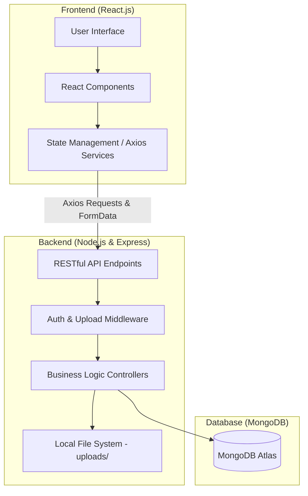
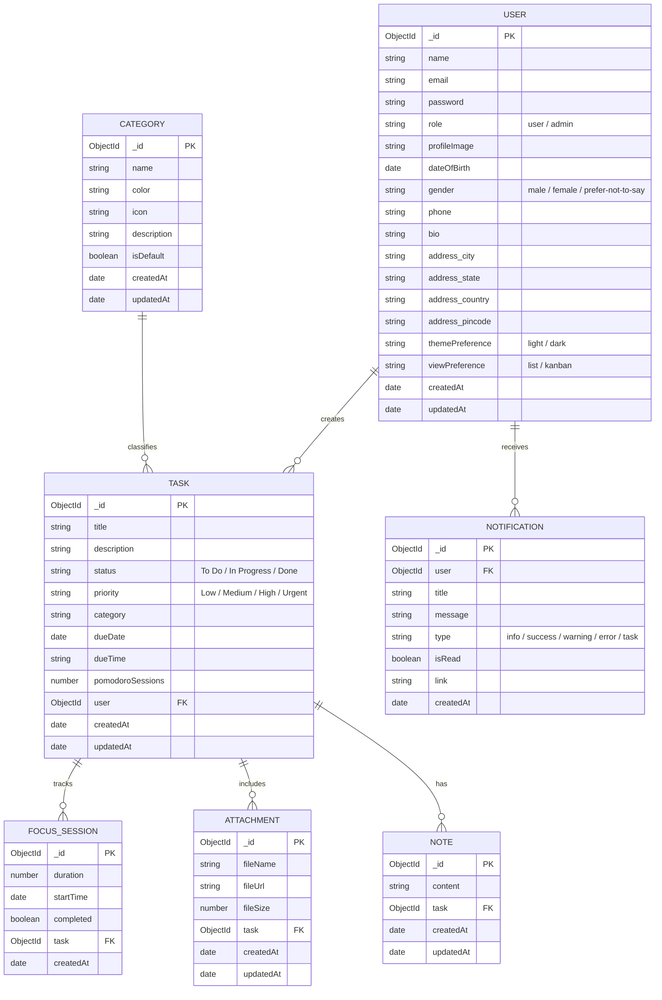
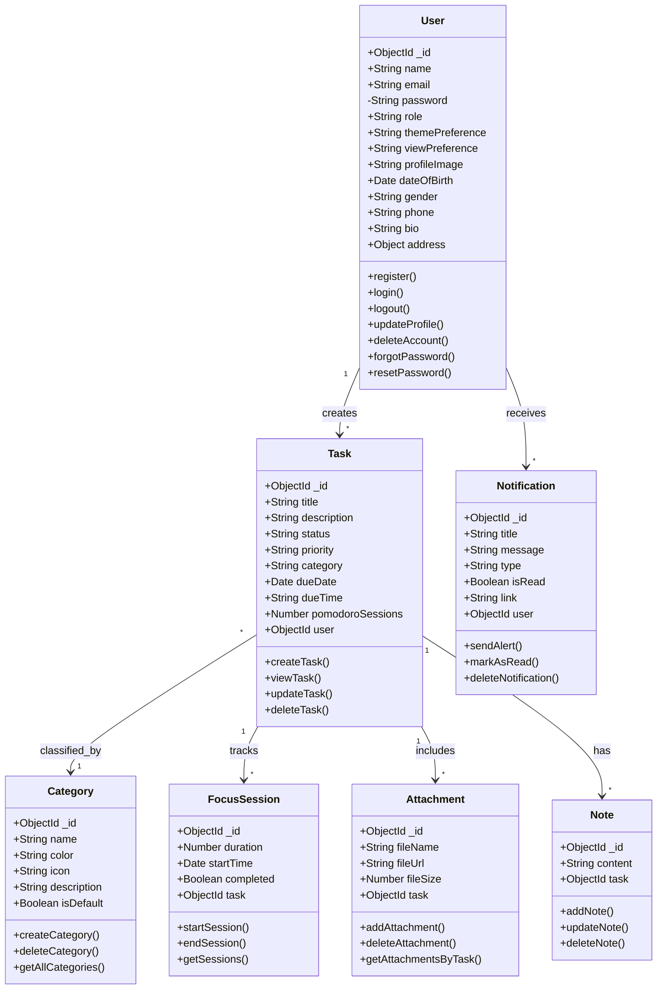
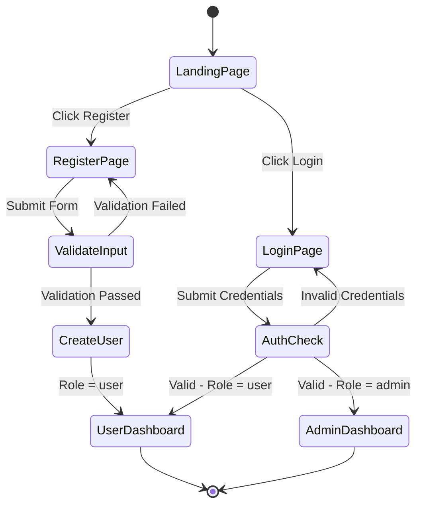
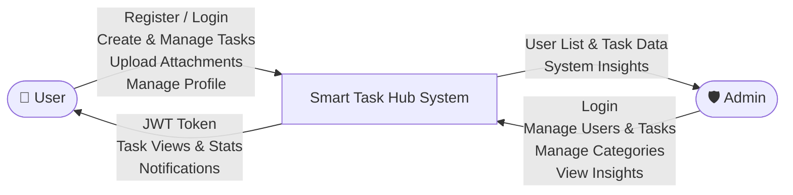
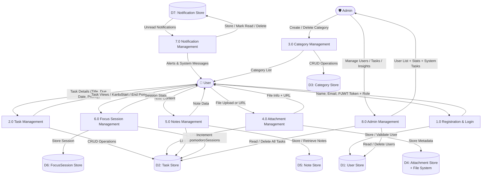
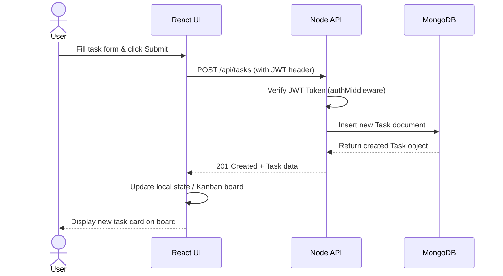

# Smart Task Hub: Project Documentation

## 1. Title Page
**Project Name:** Smart Task Hub
**Project Type:** Premium Full-Stack Task Management System
**Tech Stack:** MERN (MongoDB, Express.js, React.js, Node.js), Tailwind CSS, Multer (File Uploads)

---

## 2. Index
1. Abstract
2. Problem Statement
3. Objectives
4. Scope
5. System Architecture
6. Database Design (ER Diagram)
7. Frontend Development
8. Backend Development
9. Integration
10. Testing (Test Cases & Defect Reports)
11. Results & Conclusion
12. Diagrams (Use Case, ER, Class, Activity, Sequence, DFD Level 0 & 1)
13. Future Enhancements
14. References & Appendices

---

## 3. Abstract
**Smart Task Hub** is a premium, full-stack task management application designed to bridge the gap between simple to-do lists and complex enterprise project management tools. It provides a highly visual, role-based environment where standard users can manage personal productivity via interactive drag-and-drop Kanban boards, integrated Pomodoro timers, dynamic calendars, and data-driven statistics. Administrators can moderate users, control system-wide categories, and monitor global activity through a secure console. Users can also maintain a rich personal profile including bio, date of birth, gender, phone number, and address details.

---

## 4. Problem Statement
Traditional task management applications often suffer from:
- **Lack of Role Separation**: Minimal distinction between regular users and system administrators.
- **Poor Visual Feedback**: Text-heavy interfaces with little data visualization.
- **Rigid Categorization**: Inability to define and color-code custom categories system-wide.
- **Insecure Recovery**: Non-functional or poorly designed password recovery flows.
- **Minimal User Profiles**: No support for extended personal details like contact info or address.

---

## 5. Objectives
- **Role-Based Access Control (RBAC)**: Distinct interfaces for Users and Admins.
- **Real-Time Notifications**: System-level alerts for user actions.
- **Data Visualization**: Graphs and charts for productivity tracking.
- **Responsive Premium Design**: A state-of-the-art UI with glassmorphism and smooth animations.
- **Security**: Robust JWT authentication and secure password reset mechanisms.
- **Extended Profiles**: Users can store personal details (DOB, gender, phone, bio, address).

---

## 6. Scope
- **User Module**: Task CRUD via Drag-and-Drop Kanban Board, Extended Profile Management (name, email, DOB, gender, phone, bio, address), Advanced Statistics (Recharts), FullCalendar integration, Pomodoro Timer focus mode, Attachments (Local File Uploads & External URLs), and Personal Notes.
- **Admin Module**: User moderation, System-wide Task monitoring, Global Category management, System Insights Dashboard.
- **Auth Module**: Secure Login/Register, Admin Secure Portal, Forgot Password (SMTP Integration).
- **Database**: MongoDB for persistent storage of Users, Tasks, Categories, Notifications, Attachments, Notes, and Focus Sessions.

---

## 7. System Architecture



---

## 8. Database Design (ER Diagram)



---

## 9. Diagrams

### 9.1 Use Case Diagram

```
Actors: User, Admin
User Use Cases:
  - Register / Login
  - Manage Personal Tasks (Create, View, Update, Delete)
  - View Kanban Board / Calendar
  - Track Productivity Stats
  - Manage Profile (Personal Info, Contact, Address, Security)
  - Manage Attachments & Notes on Tasks
  - Run Pomodoro Focus Session
  - View / Read Notifications
  - Reset Password

Admin Use Cases:
  - Login (Admin Portal)
  - Manage All Users (View, Delete)
  - Monitor System Tasks (View, Delete)
  - Manage Global Categories (Create, Delete)
  - View System Insights (Stats Dashboard)
  - Manage Own Profile
```

### 9.2 Class Diagram



### 9.3 Activity Diagram (Authentication Flow)



### 9.4 Data Flow Diagrams (DFD)

#### Level 0 — Context Diagram



#### Level 1 DFD



### 9.5 Sequence Diagram (Task Creation Flow)



---

## 10. Testing & QA

### 10.1 Test Cases
| ID | Test Scenario | Expected Result | Status |
|---|---|---|---|
| TC01 | Admin Login with user credentials | Access denied — redirected to user login | Passed |
| TC02 | Create task with no due date | Task created with null due date | Passed |
| TC03 | Forgot Password Email trigger | Reset URL sent via SMTP / logged | Passed |
| TC04 | Sidebar scroll with 10+ tasks | Footer remains sticky/visible | Passed |
| TC05 | Delete user account | All associated tasks deleted | Passed |
| TC06 | Upload local PDF/Image attachment | File saved, URL linked to task | Passed |
| TC07 | Update profile with DOB, gender, address | All fields saved and reflected in UI | Passed |
| TC08 | Password mismatch on profile security tab | Inline error shown, save blocked | Passed |

### 10.2 Defect Reports
- **Issue:** Forgot Password UI mismatching theme.
  **Resolution:** Updated `ForgotPasswordPage.js` to dual-column premium layout.
- **Issue:** Sidebar logout button hidden on small screens.
  **Resolution:** Implemented `overflow-y: auto` and sticky footer in `main.css`.
- **Issue:** Profile page lacked personal details (DOB, gender, address, phone, bio).
  **Resolution:** Extended `User` model with new fields; redesigned `ProfilePage.js` with 3-tab layout.

---

## 11. Future Enhancements
1. **Real-time Chat**: Collaboration tools for team-based tasks.
2. **Mobile App**: Native iOS/Android versions using React Native.
3. **AI Task Assistant**: Automated priority suggestions based on user habits.
4. **Third-party Integrations**: Sync with Google Calendar and Slack.
5. **Social Login**: Google / GitHub OAuth support.

---

## 12. Conclusion
**Smart Task Hub** successfully delivers a professional-grade task management experience. By combining a robust MERN backend with a high-fidelity React frontend, the project meets all initial objectives of role-based management, security, and data visualization. The extended user profile system, Pomodoro timer, file attachments, and personal notes make it a comprehensive productivity platform. It stands as a scalable foundation for future enterprise productivity features.

---